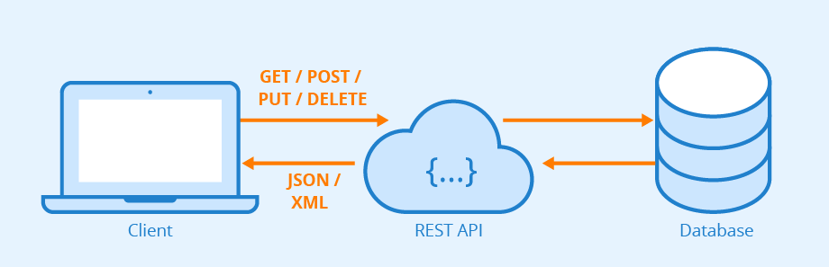

# NodeJS Api
## Introdução à Api Restful com NodeJS e MySQL.

<p align="center">
    
</p>

![version][version-badge] ![Idioma][idioma1] ![status][status-emprogresso]

### Uma API REST, também conhecida como API RESTful, é uma interface de programação de aplicativos (API ou API da Web) que obedece ao padrão de arquitetura REST. REST significa "Representational State Transfer", que em português quer dizer transferência de estado representacional.
#
### Info versões
```javascript
nodejs: 16.16.0,
body-parser: ^1.20.1,
express: ^4.18.2,
mysql: ^2.18.1,
mysql2: ^2.3.3
``` 

### Para rodar localmente este projeto é necessário:
#### Clonar o repositório
```javascript
git clone git@github.com:TomCosta/nodejs-api-class.git
``` 
#### Entrar na pasta do projeto
```javascript
cd ./user-api
``` 
### Reinstalar as dependências
```bash
npm install
```
### Rodar localmente o servidor
```bash
npm start
```
#
<p align="center">
    Made with 💜​​ by:
</p>
<p align="center">
    
</p>

[CHANGELOG]: ./CHANGELOG.md
[version-badge]: https://img.shields.io/badge/version-1.0.0-blue.svg
[license-badge]: https://img.shields.io/badge/license-MIT-blue.svg
[status-emprogresso]: https://img.shields.io/badge/status-Em%20progresso-blueviolet
[idioma1]: https://img.shields.io/badge/idioma-Portugu%C3%AAs-800060
[TOM'SYS]: https://tomsys.page/images/index-app/logo-tomsys2.png